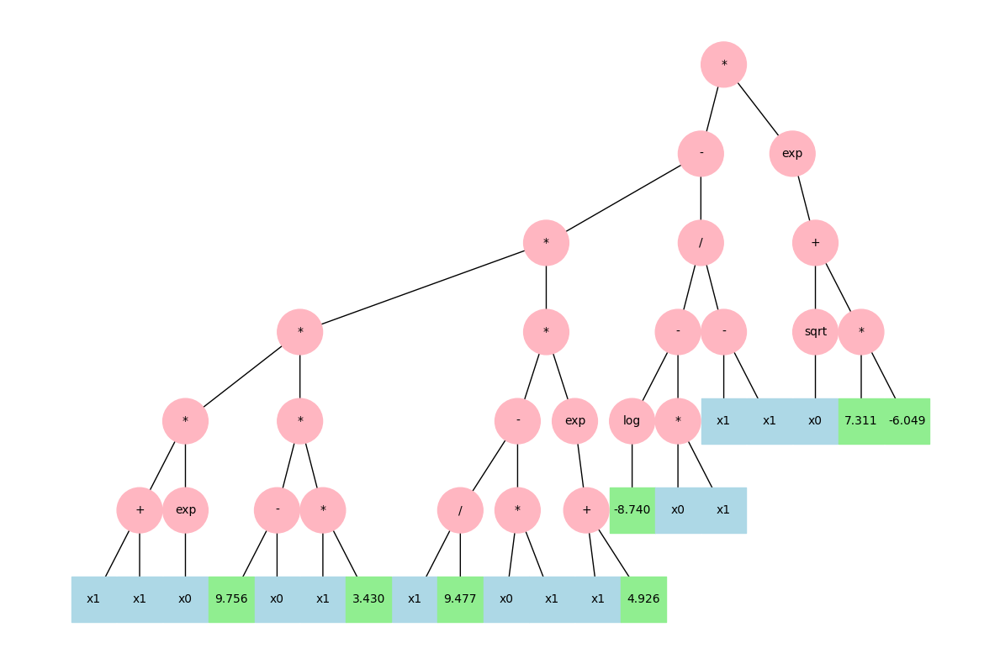
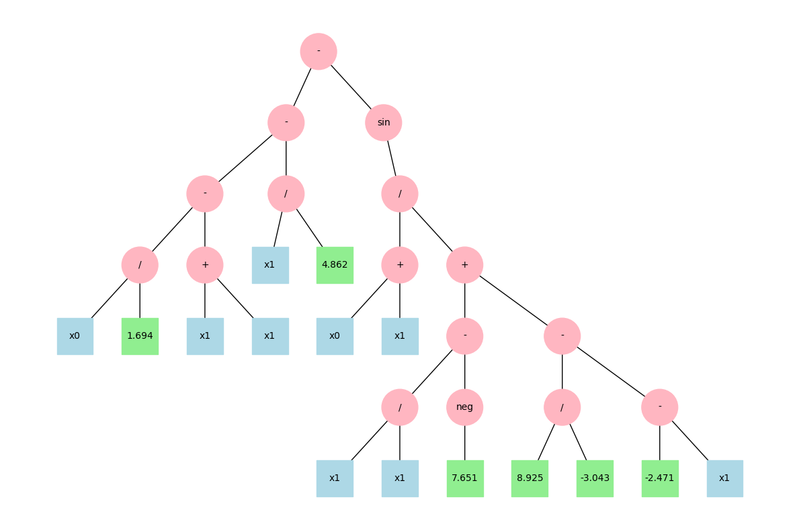
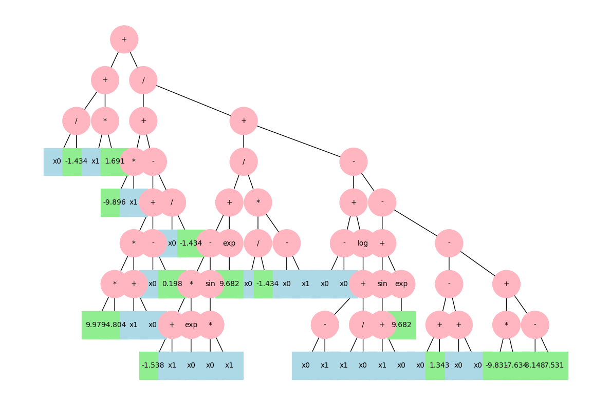
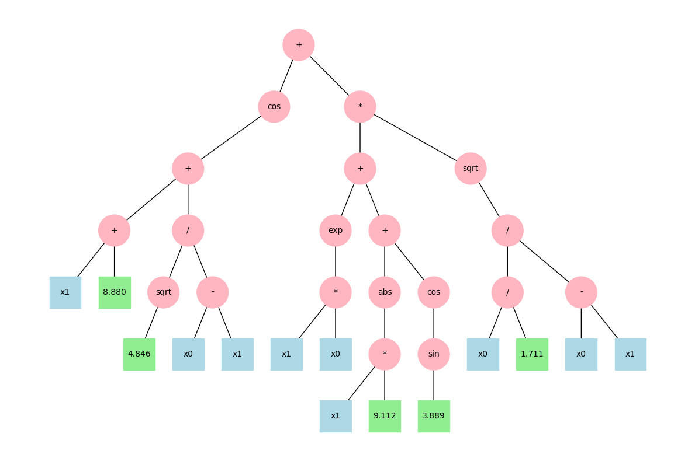
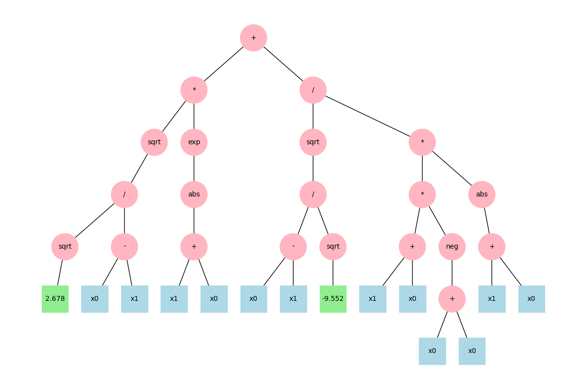
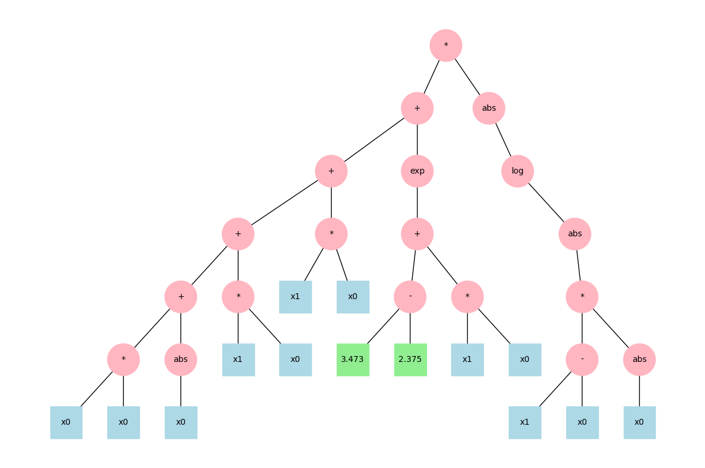

# Computational Intelligence - Lampidecchia Sergio s331080

## Laboratory 1 - Set Cover Problem

### Goal of the Lab
The goal of the first lab was to solve the Set Cover Problem.

The Set Cover Problem is a combinatorial optimization problem. 
Given a universe of elements and a collection of subsets whose union covers the entire universe, the goal is to find the smallest possible number of subsets that still cover all elements in the universe.
It is known to be NP-hard, meaning there is no known efficient algorithm to solve all instance optimally.

We tried solving it using two local search algorithms.
- **Hill Climbing**: a simple algorithm that keeps improving the solution step by step. It often gets stuck in a local minimum (a solution that looks good, but it isn't the best overall).
- **Simulated Annealing**: an algorithm that sometimes accepts worse solutions (especially at the beginning). This helps it explore more and avoid getting trapped in a local minimum.

In summary, Simulated Annealing works better for this kind of problem because it avoids getting stuck and keeps looking for better global solutions.

### Helper Functions
- `valid(solution)`: checks whether the given solution is valid by verifying if it covers the entire universe of elements.

- `cost(solution)`: computes the total cost of the solution by summing the costs of all selected sets.

 ```python
def valid(solution):
    return np.all(np.logical_or.reduce(SETS[solution]))

def cost(solution):
    return COSTS[solution].sum()
```

### Simulated Annealing Algorithm
This section presents the implementation of the Simulated Annealing algorithm. 

The initial `current_solution` is generated randomly. 
If the total number of sets (`num_sets`) is less than 1000, all sets are included in the initial solution to promote slower convergence and produce a more meaningful plot. 
Otherwise, each set is included with a 50% probability.

Simulated Annealing is a probabilistic optimization technique that allows the exploration of suboptimal solutions in order to escape local minima. The acceptance of worse solutions is governed by the following exponential probability function:
\[ P = \exp\left(-\frac{\Delta \text{cost}}{\text{temperature}}\right) \]
This function increases the likelihood of accepting worse solutions at higher temperatures and reduces it as the temperature decreases, encouraging global exploration early and local refinement later.

**Components**
- **Temperature** - `temperature`: a control parameter that influences the likelihood of accepting worse solutions. It starts high to allow broad exploration and decreases gradually, reducing randomness and leading the algorithm toward convergence.
- **Cooling Rate** - `cooling_rate`: a factor used to decrement the temperature after each iteration. Typically set just below 1 (e.g., 0.995). It ensures a smooth and steady cooling process.
- **Cost Difference** - `new_cost - current_cost`: the difference in cost between the proposed solution and the current one. A positive value indicates a worse solution, which may still be accepted depending on the current temperature.
 ```python
def simulated_annealing(sets, costs, num_sets, density, rng, initial_temp=1000.0, cooling_rate=0.995, min_temp=1e-6, max_iter=20_000):
    if num_sets < 1000:
        current_solution = rng.random(num_sets) < 1
    else:  
        current_solution = rng.random(num_sets) < 0.5
        
    current_cost = cost(current_solution)

    best_solution = current_solution
    best_cost = current_cost

    temperature = initial_temp
    history = [current_cost]

    for iteration in tqdm(range(max_iter), desc="Simulated Annealing Progress"):
        new_solution = current_solution.copy()

        swap_idx = np.random.randint(num_sets)
        new_solution[swap_idx] = not new_solution[swap_idx]  

        new_cost = cost(new_solution)

        if not valid(new_solution):
            continue
        
        
        if new_cost < current_cost or random() < np.exp(-(new_cost - current_cost) / temperature):
            current_solution = new_solution
            current_cost = new_cost

            if current_cost < best_cost:
                best_solution = current_solution
                best_cost = current_cost
 
        temperature = max(temperature * cooling_rate, min_temp)
        history.append(current_cost)

        if temperature <= min_temp:
            break

        ic(iteration, best_cost, temperature)

    return best_solution, best_cost, history
```

### Results
These are the results with `initial_temp=1000.0, cooling_rate=0.995, min_temp=1e-6, max_iter=20_000`. To improve the settlement of the cost values ​​it would be better to further decrease the `min_temp` (value of the minimum temperature) especially in cases where the universe size is 100,000.

| Universe Size | Number of Sets | Density | #Calls | Cost  |
|---------------|----------------|---------|--------|-------|
| 100           | 10             | 0.2     | 20,001 |257.208|
| 1000          | 100            | 0.2     |  5,040 |6438.395|
| 10,000        | 1000           | 0.2     |   4,194     | 136,067.908    |
| 100,000       | 10,000         | 0.1     |   4,135     |   84203534,662    |
| 100,000       | 10,000         | 0.2     |  4,135   |   182,172,834.586    |
| 100,000       | 10,000         | 0.3     |     4135   |    278,229,367.252   |

### Plots

#### Universe size = 100, sets number = 10, density = 0.2


#### Universe size = 1000, sets number = 100, density = 0.2


#### Universe size = 10000, sets number = 1000, density = 0.2


#### Universe size = 100000, sets number = 10000, density = 0.1


#### Universe size = 100000, sets number = 10000, density = 0.2


#### Universe size = 100000, sets number = 10000, density = 0.3


**Collaborators** 
Di Pantaleo Carlo - s333106: (https://github.com/carlopantax),
Brizzi Marialuigia - 334148: (https://github.com/Mars1601)

### Reviews
#### 1. [fedefortu8](https://github.com/sergiolampidecchia/CI2024_lab1/issues/1)
I think you did a very good job in solving the set cover problem. I agree with you that with Universe of 100.000 maybe the initial temperature could be lower.
A change I could suggest to you would be to dynamically decrease the temperature, for example by checking how often worse solution are accepted. If too many worse solutions are accepted, the temperature could be decreased faster. Instead, if few worse solutions are accepted, the temperature could stay higher to encourage exploration.
Again, great job, also in making clean and understandable graphs.

#### 2. [hllqna](https://github.com/sergiolampidecchia/CI2024_lab1/issues/2)
Kudos for choosing to implement simulated aneealing approach and highlighting your motivation behind this choice!

I have noticed that the proposed algorithm struggles on a larger number of sets, resulting in solutions with relatively high costs. Some of the changes that you might consider for improving your algorithm:

- Defining another initial solution. Now you take all the sets when they are 10 or 100, and ~50% sets when their number is higher. I'd suggest experimenting with these settings, possibly taking less number of sets to start from a (possibly, valid) initial solution with already a lower cost.
- Adding more "exporation" in addition to the temperature parameter with which you control exploration/exploitation balance. As I see from your algorithm, on each iteration you create a new potential solution by changing only one element(set) from untaken(False) to taken(True) or vice-versa, following more of "exploitation" approach. You could consider a more powerful tweak at least on the early iterations when dealing with large number of sets and/or creating several candidate solutions from the current one.

Overall, you've done a solid work, great job!

## Laboratory 2 - Travelling Salesman Problem 
### Goal of the Lab
The goal of this lab is to solve the Travelling Salesman Problem (TSP).

The TSP is an optimization problem. Given a list of cities and the distances between each pair of them, the goal is to find the shortest possible route that starts and ends at the same city and visits each city exactly once.

We tried solving it using a combination of Evolutionary Algorithm (which evolves the initial populations through selection, crossover, and mutation) and Simulated Annealing. 

The initial population is created using a greedy approach based on the Nearest Neighbour heuristic. This heuristic builds a solution by starting from a random city and repeatedly visiting the nearest city until the tour is complete. Although it does not guarantee an optimal result it quickly provides reasonably good solutions that serve as a solid foundation for further optimization.

### Helper Functions
- `tsp_cost(tsp)`: validates whether the selected path starts and ends at the same city and includes all cities listed in the input CSV file. It then computes the total cost by summing the distances between consecutive cities along the path.

- `Individual`: class which represents a candidate solution for the TSP. 
It has two attributes: 
    - `genome`: defines the sequence of visited cities.
    - `fitness`: is the inverse of the path cost (used for optimization purposes).

- `parent_selection(population)`: randomly selects a parent individual from the current population for reproduction.

- `xover(p1: Individual, p2: Individual)`: a crossover operator that combines the genomes of two parents to generate an offspring. It first copies a random subsequence from the first parent (`p1`) into the child genome, then fills in the remaining genes with cities from the second parent (`p2`), preserving their order and avoiding duplicates.

- `cycle_crossover(p1_genome, p2_genome)`: with a 50% probability, this function is invoked as an alternative crossover method. It applies the cyclic crossover technique, which ensures that the child inherits genetic material from both parents while preserving the relative order of cities from `p1`.

- `mutation(p: Individual)`: randomly selects a segment of the genome (with length between 3 and 5), generates all possible inversions of the segment, and, with 30% probability, perform a shift of the segment to introduce variation.

```python
def tsp_cost(tsp):
    assert tsp[0] == tsp[-1]
    assert set(tsp) == set(range(len(CITIES)))

    tot_cost = 0
    for c1, c2 in zip(tsp, tsp[1:]):
        tot_cost += DIST_MATRIX[c1, c2]
    return tot_cost

class Individual:
    def __init__(self, genome):
        self.genome = genome
        self.fitness = -tsp_cost(genome)  

def parent_selection(population):
    candidates = sorted(random.sample(population, 3), key=lambda e: e.fitness, reverse=True)
    return candidates[0]

def xover(p1: Individual, p2: Individual):
    start, end = sorted(random.sample(range(1, len(CITIES)), 2))
    
    child_genome = [None] * len(CITIES)
    child_genome[start:end] = p1.genome[start:end]

    p2_pointer = 0
    for i in range(len(CITIES)):
        if child_genome[i] is None:
            while p2.genome[p2_pointer] in child_genome:
                p2_pointer += 1
            child_genome[i] = p2.genome[p2_pointer]

    child_genome.append(child_genome[0])

    if random.random() < 0.5:
        child_genome = cycle_crossover(p1.genome, p2.genome)

    return Individual(child_genome)

def cycle_crossover(p1_genome, p2_genome):
    child_genome = [None] * len(p1_genome)
    cycle = set()
    start = 1  
    while len(cycle) < len(p1_genome) - 1:
        if start not in cycle:
            cycle.add(start)
            index = p1_genome.index(p2_genome[start])
            while index not in cycle:
                cycle.add(index)
                index = p1_genome.index(p2_genome[index])
        start += 1
    for i in cycle:
        child_genome[i] = p1_genome[i]
    for i in range(len(child_genome)):
        if child_genome[i] is None:
            child_genome[i] = p2_genome[i]
    child_genome[0] = child_genome[-1] = p1_genome[0]
    return child_genome

def mutation(p: Individual):
    genome = p.genome.copy()

    points = sorted(random.sample(range(1, len(genome) - 1), random.randint(3, 5)))
    segments = [genome[points[i]:points[i + 1]] for i in range(len(points) - 1)]
   
    inverted_segments = [seg[::-1] if random.random() < 0.5 else seg for seg in segments]
    new_genome = genome[:points[0]] + sum(inverted_segments, []) + genome[points[-1]:]

    if random.random() < 0.3:  
        start, end = sorted(random.sample(range(1, len(new_genome) - 1), 2))
        segment = new_genome[start:end]
        new_genome = new_genome[:start] + new_genome[end:]
        insert_pos = random.randint(1, len(new_genome) - 1)
        new_genome = new_genome[:insert_pos] + segment + new_genome[insert_pos:]

    return Individual(new_genome)
 ```   

### Greedy Inizialization
To generate a strong starting population, two greedy heuristic are used.
- #### Greedy Nearest Neighbor
    Greedy Nearest Neighbor method starts from an arbitrary city and always selects the closest unvisited city as the next step. 
    Although fast, it may produce suboptimal routes due to its greedy nature.

    ```python
    def greedy_nearest_neighbor():
        visited = np.full(len(CITIES), False)
        dist = DIST_MATRIX.copy()
        city = 0
        visited[city] = True
        tsp = list()
        tsp.append(int(city))
        while not np.all(visited):
            dist[:, city] = np.inf
            closest = np.argmin(dist[city])
            logging.debug(
                f"step: {CITIES.at[city,'name']} -> {CITIES.at[closest,'name']} ({DIST_MATRIX[city,closest]:.2f}km)"
            )
            visited[closest] = True
            city = closest
            tsp.append(int(city))
        logging.debug(
            f"step: {CITIES.at[tsp[-1],'name']} -> {CITIES.at[tsp[0],'name']} ({DIST_MATRIX[tsp[-1],tsp[0]]:.2f}km)"
        )
        tsp.append(tsp[0])
        logging.info(f"result: Found a path of {len(tsp)-1} steps, total length {tsp_cost(tsp):.2f}km")
        return Individual(tsp)
    ```

- #### Greedy MST-Based Heuristic 
    Greedy MST-Based method builds a route using edges selected in increasing order of distance while avoiding cycles until all cities are visited.

    ```python
    def cyclic(edges):
        G = nx.Graph()
        G.add_edges_from(edges)
        try:
            nx.find_cycle(G)
            return True
        except:
            return False

    def greedy_mst_based():
        segments = [
            ({c1, c2}, float(DIST_MATRIX[c1, c2])) for c1, c2 in combinations(range(len(CITIES)), 2)
        ]
        visited = {0}  
        edges = set()
        segments = sorted(segments, key=lambda e: e[1])
        
        for (edge, dist) in segments:
            if len(visited) == len(CITIES):  
                break
            if edge & visited:
                if not cyclic(edges | {tuple(edge)}):
                    edges.add(tuple(edge))
                    visited.update(edge)
        
        if visited:
            tsp = list(visited) + [list(visited)[0]]  
        else:
            tsp = []

        return Individual(tsp)
    ```
### Evolutionary Algorithm
To effectively solve the Travelling Salesman Problem (TSP) for a large number of cities, it is beneficial to use a high value for both `POPULATION_SIZE` and `OFFSPRING_SIZE`, ensuring sufficient diversity and exploration in the search space.

The core of the algorithm is implemented in the `evolve()` function, which takes the following arguments:
- **Population** - `population`: a list of individuals, where each individual represents a candidate path (genome) along with its associated fitness score.
- **Maximum Numbers of Generations** - `generations`: the maximum number of generations to run the evolutionary process.
- **Mutation Rate** - `mutation_rate`: the initial probability that a given individual will undergo mutation.
- **Simulated Annealing Decay Factor** - `cooling_rate`: a parameter used in the Simulated Annealing component to gradually reduce the probability of accepting worse solutions, thus balancing exploration and exploitation over time.
- **Tolerance for No Improvement** - `stagnation_limit`: the maximum number of consecutive generations without improvement in the best fitness value. When the limit is reached, the mutation rate is increased to encourage diversity.
- **Mutation Rate Adjustment** - `adaptive_increase`: the amount by which the mutation rate is increased once stagnation is detected.

During each generation, new offspring are generated by either:
- **mutation**: which randomly selects parent (based on the current mutation rate).
- **crossover**: applied to two parents to produce a child genome. 

To improve convergence, the algorithm is executed twice. 
In the second run, the best solution found in the first execution is included in the initial population to guide the search towards promising regions of the solution space.
```python
import matplotlib.pyplot as plt

POPULATION_SIZE = 100  
OFFSPRING_SIZE = 20   

population = [greedy_nearest_neighbor(), greedy_mst_based()]

for _ in range(POPULATION_SIZE - len(population)):
    random_path = list(range(len(CITIES)))
    random.shuffle(random_path)
    random_path.append(random_path[0])  
    population.append(Individual(random_path))

def evolve(population, generations=200_000, mutation_rate=0.3, initial_temperature=10_000.0, cooling_rate=0.995, stagnation_limit=5_000, adaptive_increase=0.1):
    best_path = max(population, key=lambda ind: ind.fitness)
    current_best = best_path
    temperature = initial_temperature
    stagnation_counter = 0  
    base_mutation_rate = mutation_rate  
    history = []  
    
    logging.info(f"Best initial route: Route cost: {-best_path.fitness:.2f} km")
    
    for generation in range(generations):
        offspring = []
        for _ in range(OFFSPRING_SIZE):
            if random.random() < mutation_rate:
                parent = parent_selection(population)
                child = mutation(parent)
            else:
                parent1 = parent_selection(population)
                parent2 = parent_selection(population)
                child = xover(parent1, parent2)
            offspring.append(child)

        improved = False
        for child in offspring:
            child.fitness = -tsp_cost(child.genome)
            delta_fitness = child.fitness - current_best.fitness

            if delta_fitness > 0 or random.random() < np.exp(delta_fitness / temperature):
                current_best = child
                if child.fitness > best_path.fitness:
                    best_path = child
                    improved = True
                    stagnation_counter = 0
        
        if not improved:
            stagnation_counter +=1
        
        if stagnation_counter >= stagnation_limit:
            mutation_rate = min(1.0, mutation_rate + adaptive_increase)

        if improved: 
            mutation_rate = base_mutation_rate

        population.extend(offspring)
        population.sort(key=lambda ind: ind.fitness, reverse=True)
        population = population[:POPULATION_SIZE]

        temperature *= cooling_rate
        
        history.append(-best_path.fitness)

        if generation % 10_000 == 0:
            logging.info(f"Generation {generation}: Cost of the best route: {-best_path.fitness:.2f} km")
            random_path = list(range(len(CITIES)))
            random.shuffle(random_path)
            random_path.append(random_path[0]) 
            population.append(Individual(random_path))
    
    return best_path, history

best_path, history = evolve(population)

second_phase_population = [best_path]

for _ in range(POPULATION_SIZE - 1):
    random_path = list(range(len(CITIES)))
    random.shuffle(random_path)
    random_path.append(random_path[0])  
    second_phase_population.append(Individual(random_path))

best_path_final, history_final = evolve(
    second_phase_population,
    generations=200_000,           
    mutation_rate=0.3,            
    initial_temperature=10_000.0,   
    cooling_rate=0.995,            
    stagnation_limit=5_000, 
    adaptive_increase=0.1
)
```

### Results
In order to solve the TSP problem I have implemented a solution with an Evolutionary Algorithm with the Simulated Annealing. These are the results with `generations = 200_000, mutation_rate = 0.3, initial_temperature = 10_000.0, cooling_rate = 0.995, stagnation_limit = 5_000, adaptive_increase = 0.1` for the five cities file in cvs format.

| Country | Best Path Cost | 
|---------|----------------|
| Vanuatu | 1345.54 km     | 
| Italy   | 4172.76 km     | 
| Russia  | 33534.42 km    | 
| USA     | 40728.69 km    | 
| China   | 59990.03 km    | 


### Plots
#### Vanuatu


#### Italy


#### Russia


#### USA


#### China


**Collaborators** 
Di Pantaleo Carlo - s333106: (https://github.com/carlopantax),
Brizzi Marialuigia - 334148: (https://github.com/Mars1601)

### Reviews
#### 1. [fedefortu8](https://github.com/sergiolampidecchia/CI2024_lab2/issues/1)
I think you did a great job!
I really liked the use of both greedy nearest neighbor and MST-based approaches for initializing the population, this adds an excellent diversity to the initial solutions.
Also using adaptive mutation rate and simulated annealing are wise choices that help in improving convergence.
Well done guys!

#### 2. [stysh98](https://github.com/sergiolampidecchia/CI2024_lab2/issues/2)
The code is neatly arranged. It makes good use of libraries like geopy and networkx to simplify complex tasks. Having different algorithms for solving the TSP is a smart way to show comparisons and insights. Adding more explanations in the form of comments could make the code clearer for readers. While the implementation is solid, handling larger datasets might be an issue due to the current approach to calculating distances.


## Laboratory 3 - N-puzzle Problem

### Goal of the Lab
This lab focuses on solving the n-puzzle problem. 

The n-puzzle problem is a sliding tile puzzle that consists of a grid with n numbered tiles and one empty space (represented by 0). The goal is to rearrange the tiles into a specific order, usually increasing from left to right and top to bottom by sliding tiles into the empty space.

We tried solving it using the A* Search Algorithm. The approach combines a cost-based search strategy with a custom heuristic that merges Manhattan distance and the number of misplaced tiles, both of which are admissible heuristics.

The A* algorithm finds the shortest path from a start state to a goal state. It works by combining the actual cost to reach the current state and a heuristic estimate of the cost to reach the goal. It selects the next state to explore based on the lowest total estimated cost.

### Helper Functions
- `available_actions(state: np.ndarray)`: returns a list of all possible moves from the current position of the empty tile (blank space), based on the puzzle's boundaries.
- `do_action(state: np.ndarray, action: tuple)`: executes a given move on the current puzzle state and returns the resulting new state after the move.
- `optimized_heuristic(state: np.ndarray, goal: np.ndarray)`: calculates an estimate of the remaining cost to reach the goal state. This is done by combining two metrics: the Manhattan distance and the number of misplaced tiles.

These functions are utilized within `solve_puzzle()`, which implements the A* search algorithm to find the optimal solution path to the puzzle.

```python
PUZZLE_DIM = 7  
RANDOMIZE_STEPS = 150

def available_actions(state: np.ndarray) -> list:
    x, y = [int(_[0]) for _ in np.where(state == 0)]
    actions = list()
    if x > 0:
        actions.append(((x, y), (x - 1, y))) 
    if x < PUZZLE_DIM - 1:
        actions.append(((x, y), (x + 1, y)))  
    if y > 0:
        actions.append(((x, y), (x, y - 1))) 
    if y < PUZZLE_DIM - 1:
        actions.append(((x, y), (x, y + 1))) 
    return actions

def do_action(state: np.ndarray, action: tuple) -> np.ndarray:
    new_state = state.copy()
    (x1, y1), (x2, y2) = action
    new_state[x1, y1], new_state[x2, y2] = new_state[x2, y2], new_state[x1, y1]
    return new_state

def optimized_heuristic(state: np.ndarray, goal: np.ndarray) -> int:
    manhattan_distance = 0
    misplacement_count = 0
    for x in range(PUZZLE_DIM):
        for y in range(PUZZLE_DIM):
            value = state[x, y]
            if value != 0:  
                goal_x, goal_y = divmod(value - 1, PUZZLE_DIM)
                manhattan_distance += abs(x - goal_x) + abs(y - goal_y)
                if goal[x, y] != value:
                    misplacement_count += 1

    return manhattan_distance + 2 * misplacement_count
```

### A* Algorithm with Priority Queue
This method solves the puzzle problem using the A* Algorithm with a priority queue. 
The goal is to find the shortest path (in terms of moves) to get the puzzle from an initial state to a goal state.

```python
def solve_puzzle(start_state: np.ndarray, goal_state: np.ndarray):
    frontier = PriorityQueue()
    frontier.put((0, start_state.tolist(), [start_state.tolist()], 0)) 
    visited = set()

    while not frontier.empty():
        f_cost, current_state, path, g_cost = frontier.get()
        current_state = np.array(current_state)
        if np.array_equal(current_state, goal_state):
            return path  

        state_tuple = tuple(map(tuple, current_state))
        if state_tuple in visited:
            continue
        visited.add(state_tuple)

        for action in available_actions(current_state):
            new_state = do_action(current_state, action)
            new_g_cost = g_cost + 1
            new_f_cost = new_g_cost + optimized_heuristic(new_state, goal_state)
            new_path = path + [new_state.tolist()]
            frontier.put((new_f_cost, new_state.tolist(), new_path, new_g_cost))

    return None  
```

### Results
To create a realistic starting condition, the goal state is first scrambled using a sequence of valid random moves. This is done rather than generating a completely random grid, to ensure the puzzle is solvable.

The number of random steps (RANDOMIZE_STEPS = 150) offers a good level of complexity for moderate puzzle sizes (up to 7x7 or 8x8). For larger boards, a higher number of steps may be required, though it can lead to increased computational time.

Once the initial state is ready, the A* algorithm attempts to reconstruct the path to the goal state and outputs each step in the solution, if found.

**Collaborators** 
Di Pantaleo Carlo - s333106: (https://github.com/carlopantax),
Brizzi Marialuigia - 334148: (https://github.com/Mars1601)
### Reviews
#### 1. [GiovanniOrani](https://github.com/sergiolampidecchia/CI2024_lab3/issues/1)
I think using A* is one of the best choices for this type of problem, A* is known for its efficiency in finding the optimal path in problems like this;

The heuristic used is also optimal, combining the Manhattan distance with a count of displaced tiles. This combination is more informative than using Manhattan distance alone, as it not only accounts for the distance of the tiles from their goal positions but also considers how many tiles are out of place, further improving the accuracy of the heuristic and enhancing the overall performance of the algorithm.

**Suggestions for Improvements**
It would be interesting to see an in-depth evaluation of the algorithm’s performance in terms of quality, cost, and efficiency.

A comparison with other algorithms (e.g., Greedy Best-First Search) could also be interesting to see how A* stacks up in terms of both solution quality and computational efficiency.

**Conclusion**
Overall the code looks well-written and well-structured, and it is able to obtain a result in a good time for the problem
Great job! Keep it going!

## Laboratory 4 - Project Work

### Goal of the Lab
The goal of this project is to implement a Genetic Programming (GP) algorithm to solve a Symbolic Regression problem. 
Symbolic Regression's objective is to discover a mathematical expression that fits a given dataset. Unlike traditional regression, it doesn't assume a predefined form, but it searches for the best-fitting function by combining basic mathematical operations.
In this project, the GP algorithm uses parse trees to represent mathematical expression (each tree corresponds to a candidate function). The algorithm evolves these trees over time using processes inspired by biological evolution: selection, crossover (combining parts of two expressions) and mutation (randomly changing a part of an expression).
The goal is to find an expression that closely approximates the input-output relationship in the dataset.

#### Tree Node Evalutation
The function `evaluate_node(node, x)` is used to evaluate a symbolic expression represented as a parse tree (`TreeNode`). In this tree each node represents either an operation (addition, moltiplication, division, etc.) or a variable.

This function computes the output of the expression tree rooted at a given node, using the input vector `x`, which contains the values assigned to each variable.
So this function recursively traverses the tree and evaluates each node:

- **Leaf Nodes**:
    - If the node's value is a constant (integer or float), it returns an array filled with that constant.
    - If the value is a variable (string found in the `VARIABLES` list), it retrieves the corresponding row from the input array `x` based on its position in `VARIABLES`.
    - If the value is unrecognized, a `ValueError` is raised.
- **Internal Nodes**:
    - If the node has one child, it is assumed to be a unary operator and is applied using `apply_unary_safe()`.
    - If the node has two children, it is treated as a binary operator and evaluated using `apply_binary_safe`.
    - If the number of children is unsupported, an error is raised.

**Error-Safe Function Application**
- `apply_unary_safe(func, arr)`: safely applies a unary function to an array, catching and reporting any runtime errors.
- `apply_binary_safe(func, arr1, arr2)`: applies a binary operator to two arrays, handling exceptions gracefully in case of invalid operations (e.g., division by zero).

**Supported Operators**
- `UNARY_OPERATORS` - `sin_fn`, `cos_fn`, `neg_fn`, `abs_fn`, `log_safe`, `sqrt_safe`, `exp_safe`: these are robust implementations of common mathematical functions. For example, `log_safe` avoids undefined values for non-positive inputs, and `exp_safe` prevents overflow by clipping extreme values.
- `BINARY_OPERATORS` - `add_fn`, `sub_fn`, `mul_fn`, `div_safe`: includes basic arithmetic operations with `div_safe`, providing protection against division by near-zero values.

**Modular Architecture**
All the operational logic is defined in the `FUNCTION_LIBRARY` list, which contains dictionaries with the following keys:
- `function`: a reference to the actual function implementation.
- `arity`: the number of argument required (1 for unary, 2 for binary).
- `weight`: the weight used during random tree generation.
The lists `UNARY_OPERATORS` and `BINARY_OPERATORS` are dynamically filtered from this library.

```python
def evaluate_node(node: TreeNode, x: np.ndarray) -> np.ndarray:
    """
    Evaluate a TreeNode against the input data x.
    """
    if node.is_leaf():
        return evaluate_leaf(node.value, x)
    
    op_func = node.value
    evaluated_children = [evaluate_node(child, x) for child in node.children]
    if len(evaluated_children) == 1:
        return apply_unary_safe(op_func, evaluated_children[0])
    elif len(evaluated_children) == 2:
        return apply_binary_safe(op_func, evaluated_children[0], evaluated_children[1])
    else:
        raise ValueError(f"Unsupported number of children: {len(evaluated_children)}")

def evaluate_leaf(value: Any, x: np.ndarray) -> np.ndarray:
    """
    Evaluate a leaf node value against the input data x.
    """
    if isinstance(value, (int, float)):
        return np.full(x.shape[1], float(value))
    
    if isinstance(value, str):
        if value in VARIABLES:
            return x[VARIABLES.index(value), :]
        raise ValueError(f"Unknown Variable: {value}")
    
    raise ValueError(f"Unknown leaf value: {value}")

def apply_unary_safe(func, arr: np.ndarray) -> np.ndarray:
    """
    Apply a unary function safely, catching exceptions and returning a ValueError if it fails.
    """
    try:
        return func(arr)
    except Exception as e:
        raise ValueError(f"Unary operator {func} failed with error: {e}") 

def apply_binary_safe(func, arr1: np.ndarray, arr2: np.ndarray) -> np.ndarray:
    """
    Apply a binary function safely, catching exceptions and returning a ValueError if it fails.
    """
    try:
        return func(arr1, arr2)
    except Exception as e:
        raise ValueError(f"Binary operator {func} failed with error: {e}") 

def sin_fn(x): return np.sin(x)
def cos_fn(x): return np.cos(x)
def neg_fn(x): return -x
def abs_fn(x): return np.abs(x)
def log_safe(x): return np.where(x <= 0, 0.0, np.log(x))
def sqrt_safe(x): return np.sqrt(np.abs(x))
def exp_safe(x): return np.exp(np.clip(x, -700, 700))

def add_fn(a, b): return a + b
def sub_fn(a, b): return a - b
def mul_fn(a, b): return a * b
def div_safe(a, b): return np.where(np.abs(b) < 1e-12, 1.0, a / b)

FUNCTION_LIBRARY = [
    {'function': sin_fn, 'arity': 1, 'weight': 1.0},
    {'function': cos_fn, 'arity': 1, 'weight': 1.0},
    {'function': neg_fn, 'arity': 1, 'weight': 1.0},
    {'function': abs_fn, 'arity': 1, 'weight': 1.0},
    {'function': log_safe, 'arity': 1, 'weight': 1.0},
    {'function': sqrt_safe, 'arity': 1, 'weight': 1.0},
    {'function': exp_safe, 'arity': 1, 'weight': 1.0},
    {'function': add_fn, 'arity': 2, 'weight': 1.0},
    {'function': sub_fn, 'arity': 2, 'weight': 1.0},
    {'function': mul_fn, 'arity': 2, 'weight': 1.0},
    {'function': div_safe, 'arity': 2, 'weight': 1.0}
]

UNARY_OPERATORS = [f for f in FUNCTION_LIBRARY if f['arity'] == 1 and f['weight'] > 0]
BINARY_OPERATORS = [f for f in FUNCTION_LIBRARY if f['arity'] == 2 and f['weight'] > 0]
```

### Random Tree Generation 
To support symbolic regression, expression trees are randomly generated with a recursive structure.

- `create_subtree(depth, force_variable, ...)` creates a subtree with a specified depth:
    - At depth 0, it generates either a constant or a variable. 
    If `force_variable` is specified, it forces the use of a particular variable at the leaf.
    Otherwise, it randomly chooses between a variable (from `VARIABLES`) and a numeric constant (uniformly sampled from [`CONST_MIN`, `CONST_MAX`])
    - At depth > 0 , it probabilistically chosees between unary and binary functions.
    With a given probability (e.g., 30%) a unary operator is selected from `UNARY_OPERATORS` and applied to one recursively generated child.
    Otherwise, a binary operator is selected from `BINARY_OPERATORS` and applied to two recursively generated subtrees.
- `generate_random_expression_tree(...)` generates a complete tree containing all required variables:
    - In only one variable exists, it guarantees inclusion of that variable.
    - If multiple variable exist, it randomly selects one to ensure diversity in expression structure.

```python
MAX_TREE_DEPTH = 8
CONST_MIN = -10.0
CONST_MAX = 10.0

def create_subtree(
    depth: int,
    force_variable: Optional[str] = None,  
    constant_min: float =CONST_MIN,
    constant_max: float =CONST_MAX
) -> TreeNode:
    """
    Generate recursively a subtree. If force_var is provided, it will be used as the root node.
    If depth is 0, a leaf node will be created with either a variable or a random constant.
    """
    if depth <= 0:
        if force_variable:
            return TreeNode(force_variable)
        elif VARIABLES and random.random() < 0.5:
            return TreeNode(random.choice(VARIABLES))
        else:
            return TreeNode(random.uniform(constant_min, constant_max))
        
    if random.random() < 0.3 and UNARY_OPERATORS:
        op = random.choices(
            UNARY_OPERATORS,
            weights=[f['weight'] for f in UNARY_OPERATORS],
            k=1
        )[0]['function']
        child = create_subtree(depth - 1, force_variable, constant_min, constant_max)
        return TreeNode(op, [child])
    
    else:
        op = random.choices(
            BINARY_OPERATORS,
            weights=[f['weight'] for f in BINARY_OPERATORS],
            k=1
        )[0]['function']
        left = create_subtree(depth - 1, force_variable, constant_min, constant_max)
        right = create_subtree(depth - 1, None, constant_min, constant_max)
        return TreeNode(op, [left, right])

def generate_random_expression_tree(
        depth=MAX_TREE_DEPTH, 
        constant_min=CONST_MIN, 
        constant_max=CONST_MAX
) -> TreeNode:
    """
    Generate a tree which includes at least one of the available variables.
    """
    if not VARIABLES:
        raise ValueError("There is no variable available.")
    
    selected_var = (
        VARIABLES[0] if len(VARIABLES) == 1 else random.choice(VARIABLES)
    )
    return create_subtree(depth, force_variable=selected_var, constant_min=constant_min, constant_max=constant_max)
```

### Expression String Representation
The `expression_to_string(node)` function generates a human-readable string representation of a symbolic expression tree. 

It uses the `FUNCTION_DISPLAY_NAMES` dictionary to map internal function references to standard mathematical symbols or name (e.g., `np.add` to `+`, `np.multiply` to `*`, `log_safe` to `log`, etc.).

This function supports:
- `Costants`: formatted with three decimal places.
- `Variables`: represented using an index notation (e.g., `x0`, `x1`, ...)
- `Operators`: represented using infix notation for binary operators (e.g., `x+y`, `x*y`) and functional notation for unary operators (e.g., `sin(x)`, `log(x)`)

```python
log_safe = lambda x: np.where(x <= 0, 0.0, np.log(x))
sqrt_safe = lambda x: np.sqrt(np.abs(x))
exp_safe = lambda x: np.exp(np.clip(x, -700, 700))
div_safe = lambda a, b: np.where(np.abs(b) < 1e-12, 1.0, a / b)

FUNCTION_DISPLAY_NAMES = {
    id(np.add): '+', 
    id(np.subtract): '-', 
    id(np.multiply): '*', 
    id(np.sin): 'sin',
    id(np.cos): 'cos',
    id(np.negative): 'neg',
    id(np.abs): 'abs',
    id(log_safe): 'log',
    id(sqrt_safe): 'sqrt',
    id(exp_safe): 'exp',
    id(div_safe): '/',
}

def expression_to_string(node: TreeNode) -> str:
    """
    It Returns a string representation of the tree node
    """
    if node.is_leaf():
        val = node.value
        if isinstance(val, (float, int)) and not isinstance(val, bool):
            return f"{float(val):.3f}"
        elif isinstance(val, str) and val.startswith('x'):
            return val
        return str(val)

    op = node.value
    op_name = FUNCTION_DISPLAY_NAMES.get(id(op), getattr(op, '__name__', str(op)))
    child_expressions = [expression_to_string(child) for child in node.children]
    
    if len(child_expressions) == 1:
        return f"{op_name}({child_expressions[0]})"
    elif len(child_expressions) == 2:
        return f"({child_expressions[0]} {op_name} {child_expressions[1]})"
    else:
        raise ValueError(f"Unsupported number of children: {len(child_expressions)}")
```

### GXGP Node Conversion Function
These functions convert a symbolic expression tree represented by a custom `TreeNode` into the `GXNode` structure defined in the `gxgp` library.

This conversion is necessary for the compatibility with external tools such as the `draw()` function.
- `create_variable_function(var_name)`: creates a function that returns the value associated with the given variable name.
- `create_constant_function(const_val)`: returns a function that always returns the specified constant value, regardless of input.
- `convert_tree_ to_gxgp_node(node, collected_node=None)`: recursively converts a `TreeNode` object into a `GXNode` one preserving the original expression structure.
The option `collected_node` parameter allows tracking of all created nodes, which may be useful for analysis or rendering purposes.

```python
def create_variable_function(var_name: str):
    """
    It creates a function that returns the value of a variable from the keyword arguments.
    """
    def var_func(**kwargs):
        return kwargs[var_name]
    var_func.__name__ = var_name
    return var_func

def create_constant_function(const_val: float):
    """
    It creates a function that returns a constant value.
    """
    def const_func(**kwargs):
        return const_val
    const_func.__name__ = f"{const_val:.3f}"
    return const_func

def convert_tree_to_gxgp_node(node: TreeNode, collected_nodes: Optional[Set[GXNode]]) -> GXNode:
    """
    It converts a custom TreeNode object to a GXNode object.
    If `collected_nodes` is provided, it will be used to collect the nodes.
    """    
    if collected_nodes is None:
        collected_nodes = set()

    if node.is_leaf():
        value = node.value

        if isinstance(value, str):
            var_func = create_variable_function(value)
            gx_node = GXNode(var_func, [], name=value)      
        else:
            const_func = create_constant_function(float(value))
            gx_node = GXNode(const_func, [], name=f"{float(value):.3f}") 
        
        collected_nodes.add(gx_node)
        return gx_node
    
    op = node.value
    op_name = FUNCTION_DISPLAY_NAMES.get(id(op), getattr(op, '__name__', str(op)))
    
    converted_children = [
        convert_tree_to_gxgp_node(child, collected_nodes)
        for child in (node.children or [])
    ]

    gx_node = GXNode(op, converted_children, name=op_name)
    collected_nodes.add(gx_node)
    return gx_node
```

### Fitness Fuction
The `evaluate_fitness(individual, x, y)` function evaluates the quality of a symbolic expression (represented as a `TreeNode`) by calculating the Mean Squared Error (MSE) between the predicted values `y_pred` and the actual target values `y`. 

If the output contains invalid values (NaNs or infinities), the fitness is penalized with a large constant (`1e10`).

```python
def evaluate_fitness(individual: TreeNode, x: np.ndarray, y: np.ndarray, penalty_factor: float = 0.001) -> float:
    """
    It calculates the fitness of an individual based on Mean Square Error (MSE). 
    """
    try:
        y_pred = evaluate_node(individual, x)

        if not np.all(np.isfinite(y_pred)):
            return 1e10 
        
        mse = np.mean((y - y_pred) ** 2)
        return mse
    
    except Exception as e:
        return 1e10 
```

### Selection Function
The `tournament_selection(population, x, y, k=3)` function selects the best individual from a randomly chosen group of `k` candidates from the the population. 

This stochastic selection method promotes fitter individuals while preserving diversity.

```python
def tournament_selection(population: List[TreeNode], x: np.ndarray, y: np.ndarray, k=3) -> TreeNode:
    """
    It returns the best individual from a random subset of the population (a random tournament).
    """
    contenders = random.sample(population, k) if len(population) >= k else population
    best_individual = min(contenders, key=lambda ind: evaluate_fitness(ind, x, y))
    return best_individual
```

### Crossover Functions
The `crossover(parent1, parent2)` function combines two parent expression trees by selecting random internal nodes (non-leaf nodes) from each and swapping their subtrees. 

This allows the creation of offspring that inherit structural traits from both parents.

- **Helper Functions**: 
    - `collect_all_nodes(tree)`: recursively returns a list of all nodes in the tree.
    - `select_random_node(tree)`: selects a random node from the tree (internal or leaf).
    - `clone_expression_tree(node)`: creates a deep copy of the tree.

```python
def crossover(parent1: TreeNode, parent2: TreeNode) -> TreeNode:
    """
    Crossover between two parents by swapping two internal subtrees.
    """
    offspring1 = clone_expression_tree(parent1)
    offspring2 = clone_expression_tree(parent2)
    
    internal_nodes1 = [node for node in collect_all_nodes(offspring1) if not node.is_leaf()]
    internal_nodes2 = [node for node in collect_all_nodes(offspring2) if not node.is_leaf()]
    
    if internal_nodes1 and internal_nodes2:
        node1 = random.choice(internal_nodes1)
        node2 = random.choice(internal_nodes2)
        node1.value, node1.children, node2.value, node2.children = (
            node2.value, node2.children, node1.value, node1.children
        )
    
    return offspring1


def select_random_node(tree: TreeNode) -> TreeNode:
    """
    It returns a random node from the specified tree.
    """
    all_nodes = collect_all_nodes(tree)
    return random.choice(all_nodes)

def collect_all_nodes(tree: TreeNode) -> List[TreeNode]:
    """
    It returns a list with all the nodes of the tree.
    """
    nodes = [tree]
    for child in tree.children:
        nodes.extend(collect_all_nodes(child))
    return nodes

def clone_expression_tree(node: TreeNode) -> TreeNode:
    """
    It creates a deep copy of the tree.
    """
    copied_node = TreeNode(node.value)
    copied_node.children = [clone_expression_tree(child) for child in node.children]
    return copied_node
```

### Mutation Functions
- The `subtree_mutation(individual, mutation_rate = 0.4)` function applies mutation to a cloned copy of the individual with a probability defined by `mutation_rate`. 
    - If an internal node (i.e., an operator) is selected, it's replaced by a new randomly generated subtree.
    - If a leaf node (i.e., a variable or constant) is selected, it is mutated into either a new variable (randomly selected from `VARIABLES`) or into a new random constant.

- The `hoist_mutation(individual)` function selects a random internal subtree within the individual and promotes it to become the new root. This encourages expressions simplification and structural diversity in the population. If the individual contains no internal subtree, it simply returns an unchanged clone.

```python
def subtree_mutation(individual: TreeNode, mutation_rate: float = 0.4) -> TreeNode:
    """
    With a certain probability it mutates a node of the tree.
    """
    mutant = clone_expression_tree(individual)

    if random.random() < mutation_rate:
        internal_nodes = [node for node in collect_all_nodes(mutant) if not node.is_leaf()]
        leaf_nodes = [node for node in collect_all_nodes(mutant) if node.is_leaf()]
        
        if internal_nodes and (not leaf_nodes or random.random() < 0.5):
            
            target_node = random.choice(internal_nodes)
            new_subtree = generate_random_expression_tree(
                depth=MAX_TREE_DEPTH, 
                constant_min=CONST_MIN, 
                constant_max=CONST_MAX
            )
            target_node.value = new_subtree.value
            target_node.children = new_subtree.children
        
        elif leaf_nodes:
            target_node = random.choice(leaf_nodes)
            if random.random() < 0.5 and VARIABLES:
                target_node.value = random.choice(VARIABLES)
            else:
                target_node.value = random.uniform(CONST_MIN, CONST_MAX)
                target_node.children = []
    
    return mutant

def hoist_mutation(individual: TreeNode) -> TreeNode:
    """
    Performs hoist mutation by replacing the individual with a randomly chosen subtree.
    """
    candidate_subtrees = [n for n in collect_all_nodes(individual) if not n.is_leaf()]

    if not candidate_subtrees:
        return clone_expression_tree(individual)

    return clone_expression_tree(random.choice(candidate_subtrees))
```

### Depth Tree Control
The `enforce_tree_depth_limit(node, max_depth=3, current_depth=0)` ensures that expression trees don't exceed a predefined maximum depth. 

If a node exceeds the maximum allowed depth, it is converted into a leaf node, either by assigning it a variable (from `VARIABLES`) or a random constant value. 

```python
def enforce_tree_depth_limit(node: TreeNode, max_depth: int = 3, current_depth: int = 0) -> None:
    """It reduces the depth of the tree to a maximum depth."""
    if current_depth >= max_depth:
        if VARIABLES:
            replacement = random.choice(VARIABLES + [random.uniform(CONST_MIN, CONST_MAX)])
        else:
            replacement = random.uniform(CONST_MIN, CONST_MAX)
        
        node.value = replacement
        node.children = []
    else:
        for c in node.children:
            enforce_tree_depth_limit(c, max_depth, current_depth + 1)
```

### Genetic Programming Algorithm
The `run_genetic_programming(x, y, population_size, generations, elite_size, max_depth)` function evolves symbolic expressions that approximate a target function based on input data `x` and expected output `y`. 

This evolutionary process iteratively improves a population of candidate expression trees over a number of generations, aiming to minimize the Mean Squared Error (MSE) between predicted and true outputs.

These are the main steps:
1. **Population Inizialization**
The initial population is created using a balanced approach:
    - Half of the individuals are generated with shallow trees of depth 2.
    - The other half are created with trees of depth 4.

2. **Fitness Evaluation**
At each generation:
    - Every individual in the population is evaluated using the `evaluate_fitness()` function, which computes the MSE between the predicted values and actual outputs.
    - The population is then sorted by fitness, in ascending order (lower MSE is better).

3. **Elitism and Hall of Fame**
    - The top `elite_size` individuals are preserved unchanged in the next generation.
    - The best individual of each generation is cloned and saved in the `hall_of_fame` list.
    - If this best individual achieves a lower error than any previously seen, it is stored as the overall best.

4. **Selection**
New parents are selected using tournament selection.
    - For each offspring, two parents are chosen independently via `tournament_selection()`, where 3 random individuals compete and the one with lowest MSE is selected.

5. **Crossover and Variation**
    - A crossover operation is performed between the two selected parents to produce an offspring by swapping random subtrees.
    - With 10% probability, the offspring undergoes hoist mutation, which replaces the individual with one of its own subtrees to promote simplification.
    - Otherwise, the offspring undergoes standard mutation, altering internal or leaf nodes probabilistically.

6. **Depth Enforcement**
Each new offspring is checked and pruned if necessary using `enforce_tree_depth_limit()` to ensure that the final tree doesn't exceed `max_depth`.

7. **Population Update**
The newly generated invididuals (offspring and elites) from the population for the next generation. This process repeats for the total number of `generations`.

8. **Output**
At the end of the evolutionary process, the function returns:
    - `best_overall`: the best-performing individual across all generations.
    - `best_fitness`: its associated MSE.
    - `hall_of_fame`: a list of the best individual from each generation, useful for tracking progress over time.

```python
def run_genetic_programming(x: np.ndarray, y: np.ndarray, population_size: int = 50000, generations: int = 200, elite_size: int = 2, max_depth: int = 6) -> Tuple[TreeNode, float, List[Tuple[TreeNode, float]]]:
    """
    It executes the genetic programming algorithm.
    
    Returns:
        - the best individual found,
        - its fitness value,
        - the hall of fame (best for each generation)
    """
    population: List[TreeNode] = []

    for i in range(population_size // 2):
        tree = generate_random_expression_tree(depth=2)
        enforce_tree_depth_limit(tree, max_depth=max_depth)
        population.append(tree)

    for i in range(population_size - len(population)):
        tree = generate_random_expression_tree(depth=4)
        enforce_tree_depth_limit(tree, max_depth=max_depth)
        population.append(tree)
    
    best_overall: TreeNode = None
    best_fitness: float = float('inf')
    hall_of_fame: List[Tuple[TreeNode, float]] = []  

    for generation in range(generations):
        evaluated = [(individual, evaluate_fitness(individual, x, y)) for individual in population]
        evaluated.sort(key=lambda x: x[1]) 
        
        best_current, current_fitness = evaluated[0]
      
        if current_fitness < best_fitness:
            best_overall = clone_expression_tree(best_current)
            best_fitness = current_fitness
        
        best_str = expression_to_string(best_current)
        print(f"[Generazione {generation}] Best MSE: {current_fitness:.40f} => {best_str}")
        
        hall_of_fame.append((clone_expression_tree(best_current), current_fitness))
        
        new_population: List[TreeNode] = [ind for ind, _ in evaluated[:elite_size]]
        
        while len(new_population) < population_size:
            parent1 = tournament_selection(population, x, y, k=3)
            parent2 = tournament_selection(population, x, y, k=3)
            offspring = crossover(parent1, parent2)

            if random.random() < 0.10:
                offspring = hoist_mutation(offspring)
            else:
                offspring = subtree_mutation(offspring)
            enforce_tree_depth_limit(offspring, max_depth=max_depth)
            new_population.append(offspring)
        
        population = new_population
    
    return best_overall, best_fitness, hall_of_fame
```
### Problem 1

#### Training Results

| Population | Generations | Elite | Tree | Best Expression | MSE |
|------------|-------------|-------|------|------------------|-----|
| 1000       | 100         | 2     |  | sin(x0) | 1.232595164407831e-33 |
| 1000       | 100         | 4     |  | sin(x0) | 1.232595164407831e-33 |
| 1000       | 200         | 2     |  | sin(x0) | 1.232595164407831e-33 |
| 1000       | 200         | 4     |  | sin(x0)  | 1.232595164407831e-33 |
| 10 000     | 100         | 2     |  | sin(x0) | 1.232595164407831e-33 |
| 10 000     | 100         | 4     | | sin(x0) | 1.232595164407831e-33 |
| 10 000     | 200         | 2     |  | sin(x0)  | 1.232595164407831e-33 |
| 10 000     | 200         | 4     |  | sin(x0)  | 1.232595164407831e-33 |
| 50 000     | 100         | 2     |  | sin(x0) | 1.232595164407831e-33 |
| 50 000     | 100         | 4     |  | exp((exp(((x0 - (-9.376)) / (8.985 - 3.067))) * -(-(-9.861 - x0)))) + sin(x0) | 9.860761315262648e-34 |
| 50 000     | 200         | 2     |  | sin(x0) + exp(abs(x0 + -9.009) + ((-8.017 - x0) * (x0 + 8.714))) * exp((log(8.244) / (8.173 * 8.522)) + ((x0 - x0) - (x0 - 6.700))) | 9.860761315262648e-34 |
| 50 000     | 200         | 4     |  | sin(x0) | 1.232595164407831e-33 |

#### Test Results
**Selected Tree (Best Individual)**
| Population | Generations | Elite |  Best Expression | MSE |
|------------|-------------|-------|------------------|-----|
| 50000       | 100         | 4    | (sin(x0) + (x0-x0))  |    7.125940794232773e-34   | 


### Problem 2

#### Training Results

| Population | Generations | Elite | Tree | Best Expression | MSE |
|------------|-------------|-------|------|------------------|-----|
| 1000       | 100         | 2     |  | ((exp((((x1 * 7.397) + (x1 - x1)) mul_fn ((-1.603 + x0) - exp(x2)))) / (-(((abs(x0) / (x0 + x1)) * cos((x0 sub_fn x1)))))) * ((exp((x2 + x2)) - (((x1 + x1) - (x2 * x2)) + ((x1 - x0) + (-7.663 / x1)))) + (5.996 + x2))) | 10000000000.0 |
| 1000       | 100         | 4     |  | ((((x1 + x2) - (-7.411 / 3.878)) + (-abs(x1))) - ((x0 / 4.588 + log(1.880)) + (log(-2.184) + abs(x1))) - ((exp(-x2) * ((x1 - x2) - (x0 - -2.894))) / log(((x1 * x0) - sin(x1)))) ) * exp((((-x0 + (x1 * -4.849)) / (cos(x1) - (x2 * 9.985))) - (((x0 - -3.239) / (x0 / 9.743)) / ((x0 / x0) / (x1 * -5.498))))) | 10000000000.0 |
| 1000       | 200         | 2     |  | (-( (log(x1) + (x0 + 8.780) + ((x0 * x0) * (-9.603 + x0)) ) * exp(((-8.723 / -0.237 + (x0 + x2)) * ((x1 / x0) - cos(x0)))) ) * (((sin(x2) / (0.596 / -7.257)) + ((x0 + 9.083) / (x0 * x1)) + (((-8.085 * x1) - sqrt(x1)) * -(x1 + x1))) * ((((x1 + x0) + (-9.843 * x2)) / (log(x0) + (x0 - x1))) + ((5.245 + x2 - (x1 / x0)) + (exp(x0) - (x0 * x1)))))) | 10000000000.0 |
| 1000       | 200         | 4     |  | (exp((((x1 + x2) / (x0 - x1)) - ((x0 * x2) + (7.281 * x2))) ) + abs(2.291 + x1)) * exp((x0 - -8.677) * abs(cos(x2) + (x2 / x0))) | 10000000000.0 |
| 10 000     | 100         | 2     |  | (((exp(exp(x2 + x2)) / (((x1 * x1) - (x2 * x1)) * (cos(x1) + (x0 / x0)))) - log(sqrt(-(x2 - -9.695)))) + ((-sin(x0) * (log(x2) / (x1 - x1))) + sin((sqrt(x2) - sin(x2))) + (((log(x2) / (x0 - x2)) / log(-8.240 + x2)) - ((abs(-4.428) * (x2 + x1)) / -(x0 / x2))))) | 10000000000.0 |
| 10 000     | 100         | 4     |  | log(abs(x2)) * exp(x1 - -6.033) * exp(exp(-3.918 / x2)) | 10000000000.0 |
| 10 000     | 200         | 2     | | sqrt((x2 * -3.439) * (x0 * x2)) + (log(x2 * 2.319) * (exp((x1 / x1) / (x1 * x2)) / ((x0 * x1) * exp(x0) * sin(x1 * 2.130)))) | 10000000000.0 |
| 10 000     | 200         | 4     |  | exp(((sqrt(x1 / x2) / (cos(x0) + (x0 - x0))) - ((x2 / -8.325 + (x0 + 9.413)) / ((x1 + x1) * (x2 - x0)))) ) * sqrt(exp(abs((-6.167) / (-1.414 * -0.112)))) | 10000000000.0 |
| 50 000     | 100         | 2     |  | exp((x1 - x0) * exp(8.466)) * exp((5.960 / -2.275) * (x2 + -1.079)) | 10000000000.0 |
| 50 000     | 100         | 4     |  | exp(abs(-x0)) * ((1.063 * -1.013 + -x2) * (exp(abs(x1 + x1)) * exp(exp(x0 + x0))))| 10000000000.0 |
| 50 000     | 200         | 2     |  | (exp(-x0) / (log(-1.520) + cos(x2))) * ((-2.503 * x1 + (x1 / x2)) * exp(exp(9.945))) | 10000000000.0 |
| 50 000     | 200         | 4     |  | exp((x1 * x1) * (8.108 * 7.968)) * (exp(x2 * 2.783) / ((1.560 * -7.048) / (x2 - x1))) | 10000000000.0 |

#### Test Results
**Selected Tree (Best Individual)**
| Population | Generations | Elite |  Best Expression | MSE |
|------------|-------------|-------|------------------|-----|
| 1000       | 100         | 2    | (exp((sqrt(x1) / sin(x2)) / ((x0 * -0.466) * exp(x2))) / exp(((x2 / 4.004) * (6.319 - -7.442)) * ((-7.637 + x2) + log(x1)))) * cos((sqrt(x0 * x2) * ((x1 / 9.200) * (x0 * 4.569)) + (((x0 / x0) / (-x1)) * ((x1 * x2) + (x2 + 3.061)))))  |    10000000000.0   | 


### Problem 3

#### Training Results

| Population | Generations | Elite | Tree | Best Expression | MSE |
|------------|-------------|-------|------|------------------|-----|
| 1000       | 100         | 2     |  | ((x1 * -6.949 - (x2 - 9.187)) + sin((sin(-1.607) + (x2 * -4.690)) + (log(x1) + sqrt(1.443)))) + ((-8.168 * x1 + (x0 * x0)) + (((x1 * x1) * sin(sin(x1))) + ((x0 * x0) + ((x0 + x1) + (-3.642 + x1))))) | 223.85528714907912 |
| 1000       | 100         | 4     |  | (((x1 * x1) * sin(x1) - (x1 * 9.376)) + (abs(8.512 * x0) + ((x1 * x1) * sin(x1)))) - ((x1 + x2) + (x2 + x1)) | 79.73478503716484 |
| 1000       | 200         | 2     |  | (((x1 * -8.646) * sqrt(x1) + (sqrt(x1 + x2) + (x0 * x0))) + sqrt(((x0 + x2 + (x0 + -6.324)) * log(5.811 * x1)))) + (((x0 * x0) + ((-1.713 * x2) * sqrt(-6.147))) + (x1 + x2)) | 131.42016754718148 |
| 1000       | 200         | 4     |  | (((x1 * -6.923 - sqrt(x1)) + (x1 * -6.923)) * cos(abs(-9.687) - (x1 * 0.618))) + (((x1 * -6.923 - (x2 + x2)) + ((x1 * -6.923) - (x1 * -6.923))) + (((x0 * x0) - (x2 + x2)) + (x0 * x0))) | 47.3783849475778 |
| 10 000     | 100         | 2     |  | ((sqrt(x1) * (x1 * -8.288) + ((x0 * x0) + (-2.828 * x2))) + (x0 * x0)) + sqrt((((x2 * x0) + (x1 * 1.032) + ((x1 + 9.521) + (x2 * 0.261))) + sqrt((-2.064 + -9.140 + sqrt(x1))))) | 153.6398727708794 |
| 10 000     | 100         | 4     |  | ((-3.198 * x2) + (sqrt(sqrt(x1 + x2)) + sqrt((x2 + x2) + (-8.033 + x1)))) + (exp(-x1) + ((x0 * x0) - exp(x1)) + ((x0 * x0) + -x1)) | 30.403476313352 |
| 10 000     | 200         | 2     |  | (((x1 - 0.205) * ((x1 - x1) - (x1 * x1))) - (((x2 + -2.070) - (x0 * x0)) - (x0 * x0))) - (x2 + x2) | 4.163563882888609 |
| 10 000     | 200         | 4     |  | (((x1 * x1) * -x1 + (x2 * -3.520)) + ((x0 * x0) + (x0 * x0))) + sqrt((6.207 + -3.814) - ((3.234 * 5.211) + abs(sin(-7.953)))) | 0.007478482631722164 |
| 50 000     | 100         | 2     |  | ((-x1 * (x1 * x1) + (x0 * x0)) + ((x2 * -3.577) + (x0 * x0))) + log(((-9.429 * -6.194) + (x2 + x2) + (x1 - 7.730) + sin((x2 + x1) + log(x2)))) | 0.0205730188858343 |
| 50 000     | 100         | 4     |  | ((sqrt(9.892) + (x0 * x0) - (x2 * 3.526)) + (x0 * x0)) + (sqrt(cos(x2) / (-x2 + (3.243 + x2))) + ((x1 * x1) * -x1)) | 0.21534338648485754 |
| 50 000     | 200         | 2     |  | (((3.997 - x2) + (x0 * x0) + ((x0 * x0) + (x2 * -3.300))) + ((x1 * x1) * -x1)) + (x2 * 0.766) | 0.009129632337707066 |
| 50 000     | 200         | 4     |  | log((-9.961 * -6.706) + ((-9.673 + x0) - (x2 * -3.260))) + ((x2 * -3.531) + (x0 * x0) + (x0 * x0) + (-x1 * (x1 * x1))) | 0.00859152561702205 |

#### Test Results
**Selected Tree (Best Individual)**
| Population | Generations | Elite | Best Expression | MSE |
|------------|-------------|-------|------------------|-----|
| 10000      | 199         | 4     | sin((((x2 - x2) / (((log(abs(x1)) - (x1 * x2)) / ((-9.103 - x2) * ((x2 / x1) + abs(x0))))) + cos(6.457))) + ((x0 * x0) + ((x2 * -2.504) + ((x0 * x2) * (x0 / x2)) + (((x1 * x1) * (-x1)) - (-3.167 + x2))))) | 0.0001337986105768977 |


### Problem 4

#### Training Results

| Population | Generations | Elite | Tree | Best Expression | MSE |
|------------|-------------|-------|------|------------------|-----|
| 1000       | 100         | 2     |  | ((cos(x1) + cos(x1) + (-6.759 + 7.872)) * sqrt(-3.827 + -5.884)) + sin((abs(cos(-5.551)) + cos(3.470) + cos(x1))) | 0.07730668984211835 |
| 1000       | 100         | 4     |  | exp(cos(x1) + cos(-6.906)) + ((cos(x1) + cos(x1)) + (cos(x1) + cos(x1))) + sin(((x0 / -8.916) + cos(x1)) + ((x0 / x0) + cos(x1))) | 0.1513260024074732 |
| 1000       | 200         | 2     |  | (sqrt(8.379) + (cos(x1) + cos(x1))) / (sin(cos(x1)) + (sin(5.130) + (x0 + 9.550))) + (sqrt(8.379) + (6.761 * cos(x1))) | 0.025681362351684497 |
| 1000       | 200         | 4     |  | sqrt(sqrt(5.903 + x0) + (8.606 - x0)) + (cos(x1) * exp(sqrt(-3.832))) | 0.010993211984707072 |
| 10 000     | 100         | 2     |  | (cos(x1) + (x0 - x0) + (cos(x1) + (cos(-7.055) + cos(x1))) + sqrt(3.102)) + ((cos(x1) + cos(x1)) + cos(sin(exp(x0))) + (cos(x1) + cos(x1))) | 0.05212421784119909 |
| 10 000     | 100         | 4     |  | cos(x1) + cos(x1) + cos(x1) + (exp(cos(5.725)) + cos(x1)) + (cos(x1) + (cos(x1) + cos(0.191) + cos(x1))) | 0.07454887087832061 |
| 10 000     | 200         | 2     |  | cos(x1) + (((-0.108 + 6.068) * cos(x1)) + sqrt(-0.336 + -9.598)) + (cos(x1) + (((x0 + x0) * cos(-3.420)) + sqrt(-5.392))) / ((((x1 + x1) / (x1 + x1)) + (3.331 * 5.671)) - (x0 - x0)) | 0.0005300312457952195 |
| 10 000     | 200         | 4     |  | sin((sqrt(9.357) + ((x0 / x0) * -x0)) / (sqrt(-9.604) + (abs(-6.969) + (x0 + 1.953)))) + (sqrt(9.357) + ((cos(x1) * abs(5.941)) + cos(x1))) | 0.01414040681238817 |
| 50 000     | 100         | 2     |  | (sqrt(-5.298) + (cos(4.726) * (x0 + -0.663)) + ((x1 / -9.864) / (x1 / x0)) + (cos(x1) * (9.103 + -2.061))) + ((((x0 / x0) * (x0 + -5.596)) + ((x1 - -7.689) - (-6.161 * x1)) + log(x0 / x0)) / ((x1 - x1) * ((x1 - x1) + ((x0 * x1) + (x1 * 8.279))))) | 0.0008725040729473489 |
| 50 000     | 100         | 4     |  | (cos(x1) + (cos(7.561) * sqrt(5.644)) + cos(x1) + (cos(x1) + sqrt(sqrt(-6.969 + x0))) + (cos(x1) + ((cos(0.351) + (8.638 + x1)) / (x0 - x0)) + ((cos(x1) + cos(x1)) + cos(x1)))) | 0.007245638091330456 |
| 50 000     | 200         | 2     |  | ((cos(x1) * 6.985) + sqrt(4.358) + ((x0 - 1.849) / (-2.424 * 6.622))) + (((cos(-1.242) * 8.529) + sqrt(5.312) + ((x0 - -0.727) / -7.840)) / 4.626) | 0.00010275918875072761 |
| 50 000     | 200         | 4     |  | ((sin(x0 - x0) + ((-4.278 / x1) + (2.996 + 0.091))) / (((x1 / x0) + (7.595 + x1)) + cos(x1))) / (log(-2.880) / (((-1.940 / x1) + (x1 + x1)) + ((x0 / x1) + cos(x0)))) + ((-0.092 * x0) + (sqrt(-5.179) + (cos(x1) * (-0.208 + 7.196)))) | 6.986181685345716e-05 |

#### Test Results
**Selected Tree (Best Individual)**
| Population | Generations | Elite |  Best Expression | MSE |
|------------|-------------|-------|------------------|-----|
| 50000       | 200         | 4     | ((x0 / -9.239) / ((x0 * 8.815) / (x0 / x0)) + ((x0 / -1.188) / abs(9.368)) + ((cos(x1) * abs(7.003)) + (-6.538 * -0.504)))  |1.495061516474593e-05   |


### Problem 5

#### Training Results

| Population | Generations | Elite | Tree | Best Expression | MSE |
|------------|-------------|-------|------|------------------|-----|
| 1000       | 100         | 2     |  | (exp(-1.295 / 0.038) / (-6.078 / x1)) * ((((x1 - -2.563) + (x0 / x0)) / (exp(x1) / (0.479 / x1))) / ((x0 - x0) * (x1 - x1)) * (((1.892 * x0) * (-8.654 * -9.857)) + (((x1 / 0.062) * (x0 * x1)) * exp(x1 + x0)))) | 1.3456256247873031e-19 |
| 1000       | 100         | 4     |  | log((((x1 * x0) * (x1 + 3.433)) + ((x1 / x1) + (-0.955 + -1.061))) - ((x1 / x0 + sin(x1)) * sin(x1 / x1))) / (- (exp(-4.105 * -5.579) + (abs(x1) * (x0 - -2.457))) + (((x0 * x0) / sin(x1)) + ((-5.563 + 4.986) * (x1 / x0)) + (((x1 - x0) / -8.247) + (log(5.142) + cos(x0))))) | 4.492609660239063e-18 |
| 1000       | 200         | 2     |  | exp(-4.157 * 6.774) * ((x0 * x0) - (exp(x0 + x1) - ((x1 * x1) * abs(8.489)))) * (abs(x1) - (((x1 / 8.024) / exp(-0.607)) - ((x0 / 4.746) * (-7.213 / x0)))) | 8.906139275216689e-20 |
| 1000       | 200         | 4     |  | (((((x0 / x0) - (-0.269 * -4.306)) - ((-4.803 - x0) + (-3.699 * x1))) - (((x0 + x1) + (x1 * 0.127)) - (x1 * x0))) - (exp(x1 + x0) * ((8.034 + 4.287 + (x1 / x1)) + (x1 * x1)))) * (exp(-3.656 / 0.107) * (((x1 / -1.013) + (x0 * x1)) + (abs(-5.719) - ((x1 - x0) * sin(x0))))) | 2.864844178778442e-20 |
| 10 000     | 100         | 2     |  | ((((x0 * x1) - log(-8.740)) / (x1 - x1)) - (((x0 * x1 - (x1 / 9.477)) * exp(x1 + 4.926)) * ((x1 + x1) * exp(x0) * ((9.756 - x0) * (x1 * 3.430))))) * exp((7.311 * -6.049) + sqrt(x0)) | 6.792401551634288e-20 |
| 10 000     | 100         | 4     |  | sqrt((((sin(x0) - (0.078 - x1)) / exp(4.788 * x1)) - (abs(x1 * x0) * exp(-2.422 + x1))) * ((((x0 - x1) + exp(x1)) - ((x0 * x1) / cos(x0)) - exp(x1 + x0)) / exp(-6.887 * -4.375))) | 7.44524328032681e-20 |
| 10 000     | 200         | 2     |  | (((((x1 / x1) - (9.480 / 9.588)) / ((x0 - x0) + exp(7.173))) / (((x1 * x1) / (x1 * x1)) + ((-3.370 / x0) / (-3.977 * x1)))) + ((exp(x0) * ((x0 + x0) / cos(1.529))) * (sin(7.454 + x1) * (8.017 * 9.205)))) / ((((-4.521 * x1) / ((x0 * x1) * (x1 * 8.328))) - ((8.232 * -6.404) + (x0 / x0))) + exp((-4.521 * x1) - (8.232 * -6.404))) | 4.151534807750038e-19 |
| 10 000     | 200         | 4     |  | ((1.019 * x1 + sin((x0 - -7.847) + (x1 + -3.428))) / exp(-5.696 * -5.132)) * ((((3.995 / x0) - (-0.159 - x1)) + (exp(5.444) - (-2.529 - x1))) - ((x0 + x0 + exp(x0)) + ((x0 + x1) - exp(x1))) - exp(x0 + x1)) | 5.377141398240036e-20 |
| 50 000     | 100         | 2     |  | ((x0 * x1) / exp(-5.194 * -5.871)) * (((sqrt(x1 * x1) / ((x0 / -4.987) / exp(x0))) / (((x0 + x0) + (x1 * x1)) / ((x0 * -9.005) - (x1 * x1)))) - exp(x1 + x0)) | 5.065573626967043e-20 |
| 50 000     | 100         | 4     |  | -exp(((x1 + -3.637) - ((x0 + x1) / (-9.915 / x0)) - (-2.863 * -8.259))) | 9.654832077334553e-20 |
| 50 000     | 200         | 2     |  | (exp((x1 + x0) - (-8.491 * -3.025)) / (((-6.197 - 9.047) + (-6.197 - 9.047)) - ((-8.995 - x0) / (x0 - x0)))) / ((((2.642 * -0.477) * (x0 * x1) - ((2.584 - 4.964) - (3.623 - x0))) / (((8.783 * x0) - (x1 - x1)) - (-3.433 * -3.025))) / ((((x0 * x0) - log(5.057)) * ((5.932 + -0.609) - (x1 * x1))) / ((exp(x0) / (x0 - 1.104)) / ((x1 / 6.245) / (8.686 / x0))))) | 2.677134020594907e-20 |
| 50 000     | 200         | 4     |  | (((x1 / -2.599) * (x0 * x1)) * (exp(x1 + x0) + (exp(x1) * ((x0 * x1) - (6.736 + 3.326)))) ) / ((exp(exp(3.443)) - (((-0.349 * x1) / (x1 / 1.203)) / (x0 / -9.607))) - (log((x1 * x1) - (x0 / x1)) * (((6.771 / x0) / sqrt(x1)) / ((-9.610 * x1) / log(-7.630))))) | 2.4909086252648227e-20 |

#### Test Results
**Selected Tree (Best Individual)**
| Population | Generations | Elite |  Best Expression | MSE |
|------------|-------------|-------|------------------|-----|
| 50000       | 200         | 4     | (exp(x1) + (8.736 + x1) + exp(x0) + ((exp(x0) / (x1 - 5.465)) * (x1 * x1))) / ((exp((x1 * x1) - abs(x0)) * abs(exp(6.353) / (-5.603 - x1))) + ((x0 * x1) + (4.408 * x0) + ((x1 / -2.113) * (2.529 * x1)) + exp(-3.779 / -0.145)))  |2.651652350332708e-20   |


### Problem 6

#### Training Results

| Population | Generations | Elite | Tree | Best Expression | MSE |
|------------|-------------|-------|------|------------------|-----|
| 1000       | 100         | 2     |  | ((x1 + x1) - (x0 / 1.694) - (x1 / 4.862)) - sin((x0 + x1) / (((x1 / x1) - (-7.651)) + ((-2.471 - x1) - (8.925 / -3.043)))) | 0.003268826412894664 |
| 1000       | 100         | 4     |  | ((x1 / 0.520) - (0.554 * x0) - (x1 / 5.366)) - ((0.554 * x0) / ((log(log(-9.635)) - cos(x1 + -9.222)) - (((x1 - x0) - abs(3.859)) - ((-1.790 - x0) + exp(x1))))) | 0.009908128649451549 |
| 1000       | 200         | 2     |  | ((x1 / 1.672) * (-1.122 / -9.672)) + ((x0 / 7.010) + (x0 / 7.010) + ((x1 - x0) + (x1 / 1.672))) | 0.004722516930400493 |
| 1000       | 200         | 4     |  | (((x1 * 1.696) + (x0 / 7.684) + ((x0 + -0.966) / (4.035 + x0))) - (x0 + -0.390)) + ((x1 - x1) * ((x0 - x1) - ((x1 + x1) - (x0 + -0.390)))) | 0.038034203137896384 |
| 10 000     | 100         | 2     |  | (x0 / -1.458 + (x1 * 1.704)) / ((((x1 / x0 + (9.455 * x0)) / (x0 - x0)) / ((x0 / -1.431) + ((2.648 + x0) / (x1 * x0)))) / (log(-0.233) * ((x1 / x1) / log(x1 + x1)))) | 0.0007181361907544501 |
| 10 000     | 100         | 4     |  | (x0 / -1.431 + (((x1 / -3.227) + (x1 + x1)) - (((2.223 - x0) * exp(-3.216)) / (9.442 + 6.636)))) - (x1 - x1) | 9.363433461774159e-05 |
| 10 000     | 200         | 2     |  | exp(-9.708 + -8.508) * (((( -9.832 + -7.805 + (x0 + x1)) * ((x1 + x1) + (x1 * x0))) * (((x0 * 0.199) + (x0 - -6.194)) + ((x0 + 9.993) * (x1 * x1))))) + (((0.695 * x1) + (x1 - x0)) + ((x0 * 0.323) / (-9.708 + -8.786)) + (x0 * 0.323)) | 7.876963045634546e-07 |
| 10 000     | 200         | 4     |  | ((((x1 / -8.959) / (-4.229 + 7.677)) / (x1 - 5.813)) * (((x1 - x0) - (x0 / x1)) - (x1 - x0))) + (((x1 / -8.959) / (-4.229 + 7.677)) + (((x1 * 0.731) + (x1 - x0)) - (x0 / -3.193))) | 7.842123850265488e-05 |
| 50 000     | 100         | 2     |  | ((4.714 * x0) / ((exp(-7.926) - (x0 / -0.009)) / (x1 + x0))) + ((x0 / -1.366) + (1.654 * x1)) | 5.173764848659719e-05 |
| 50 000     | 100         | 4     |  | ((x1 / 0.581) + (-0.688 * x0) - ((x1 / 0.581) / ((x0 * x0) - (-7.502 * 7.414)))) - ((x0 - x0) * ((x0 - x0) - (((x0 / x1) + (x1 * -5.253)) - ((x0 / x1) + (-8.729 / x1))))) | 0.00023849185688837437 |
| 50 000     | 200         | 2     |  | ((sin(2.380) * log(sin(log(5.130)))) * ((x1 * 1.697) + (sin(2.380) * -x0))) + ((x1 * 1.697) + (sin(2.400) * (-1.030 * x0))) | 2.780662271513063e-07 |
| 50 000     | 200         | 4     |  | ((x1 - x0) + (x1 * 0.694) + (x0 / 3.275)) + (((sin(sqrt(x0)) + (log(x1) * (x1 * x1))) / ((log(x1) - sin(x0)) - (-9.735 - (x0 * x0)))) / (((x1 * -6.370 + (x1 / 2.122)) * exp(x1 + 8.682)) / (((x1 * 6.287) + (x0 - x0)) + ((x1 + x0) - (x1 - x0))))) | 1.399923933491975e-07 |

#### Test Results
**Selected Tree (Best Individual)**
| Population | Generations | Elite | Best Expression | MSE |
|------------|-------------|-------|------------------|-----|
| 50000      | 200         | 4     | ((((((x0 - 0.198) + ((9.979 * -4.804) * (x1 + x0))) - (x0 / -1.434)) + (-9.896 * x1)) / ((((x0 - x1) * (x0 / -1.434)) / (((-1.538 + x1) * exp(x0) - sin(x0 * x1)) + exp(9.682))) + (((x0 - x0) + log((x0 - x1) + (x1 / x0))) - ((sin(x1 + x0) + exp(9.682)) - (((8.148 - 7.531) + (-9.831 * -7.634)) - ((x0 + x0) - (x0 + 1.343)))))) + ((x0 / -1.434) + (x1 * 1.691)))) | 8.251367834469018e-11 |


 

### Problem 7

#### Training Results

| Population | Generations | Elite | Tree | Best Expression | MSE |
|------------|-------------|-------|------|------------------|-----|
| 1000       | 100         | 2     |  | exp(x0 * x1) + abs(((x1 * x1) / (x1 - x0)) - ((x0 * x0) + (-2.720 + -2.300))) + ((x1 * x0) * exp(x1 * x0)) | 96.78909080151286 |
| 1000       | 100         | 4     |  | sqrt(((cos(x0) + sqrt(-3.580) + ((-7.225 * x1) / (x1 - x0))) * ((x1 - 5.755) - (log(-4.994) + (x0 * x0)))) + exp((x1 * x0) + exp(log(x1)))) | 169.5575736805357 |
| 1000       | 200         | 2     |  | (sqrt(sqrt(-5.828) / (x1 - x0)) * exp(x1 * x0)) + sqrt(((6.001 - x0) + (x0 * -1.519)) / (x1 - x0)) | 52.03038411175145 |
| 1000       | 200         | 4     |  | abs(((x0 * x0 + x0 * x1) / (x0 - x1)) - ((9.092 / -3.620) - (exp(x1 * x0) - sin(cos(x1 + x0))))) | 71.3405964328654 |
| 10 000     | 100         | 2     |  | exp(x0 * x1) * sqrt(((exp(x1) * sqrt(-1.366)) + (sin(x0) - sqrt(x0)) - (sqrt(x0 * 4.545) - (sqrt(7.150) / (x0 - x1))))) | 81.29430686154775 |
| 10 000     | 100         | 4     |  | sqrt((((x0 * 3.449) * exp(sqrt(x1))) * exp(x1 * x0)) * abs(abs((x0 * x0) / (x1 - x0)))) | 48.71670314544191 |
| 10 000     | 200         | 2     |  | sqrt(((x0 * x1) / (x1 - x0)) * (exp(x0 * x1) * ((6.911 - -7.931 + (x1 + x1)) + ((7.599 - x1) + sqrt(9.141))))) | 20.959220560618718 |
| 10 000     | 200         | 4     |  | (abs(sqrt(x1 + x1) / (x0 - x1)) * (x0 * x0)) + (sqrt(sqrt(abs(8.899)) + (x1 * x0)) * exp(x1 * x0)) | 25.24886343888817 |
| 50 000     | 100         | 2     |  | (sqrt((x0 / 1.711) / (x0 - x1)) * ((cos(sin(3.889)) + abs(x1 * 9.112)) + exp(x1 * x0))) + cos((x1 + 8.880) + (sqrt(4.846) / (x0 - x1))) | 31.197947266494612 |
| 50 000     | 100         | 4     |  | sqrt((((x1 + x0) * ((x0 * x1) - (7.106 + -9.507)) / (x0 - x1)) * ((exp(x1 * x0) * (2.149 - -1.517)) + (((x0 / 3.875) / (x1 * x0)) - ((-3.159 - x0) - (-x0)))))) | 25.00327822125161 |
| 50 000     | 200         | 2     |  | ((((x1 + x0) * -(x0 + x0)) * abs(x1 + x0)) / (sqrt(-9.552) / (x0 - x1))) + ((sqrt(2.678) / (x0 - x1)) * exp(abs(x1 + x0))) | 15.878867371822496 |
| 50 000     | 200         | 4     |  | (((x0 * -0.254) * (-5.257 / 2.930)) / (log(x0 / x1) * ((sqrt(x1) / sqrt(x1)) + (abs(4.540) / (8.777 + x1))))) + ((abs(-5.843) + exp(x1 * x0)) / sqrt(log(x0 / x1))) | 22.444388114211876 |

#### Test Results
**Selected Tree (Best Individual)**
| Population | Generations | Elite |  Best Expression | MSE |
|------------|-------------|-------|------------------|-----|
| 50000       | 200         | 2     | (abs(log(abs((x1 - x0) * abs(x0)))) * ((((x1 * x0) + (abs(x0) + (x0 * x0))) + (x1 * x0)) + exp((3.473 - 2.375) + (x1 * x0))))  | 50.190404707841470  |



### Problem 8

#### Training Results

| Population | Generations | Elite | Tree | Best Expression | MSE |
|------------|-------------|-------|------|------------------|-----|
| 1000       | 100         | 2     |  | ((((x5 * 8.946) + (-9.179 * 8.105)) / exp(x5)) + (((x4 + x2 - sqrt(x0)) + (sin(x4) + (x1 - x2))) + (((x4 + x5) / (x5 - x3)) / ((x2 * -7.903) + (x4 / 8.446))))) - ((-6.497 * 8.105) * (exp(x5) + (exp(x5) + (exp(-7.786) + cos(x2))))) | 22.444388114211876 |
| 1000       | 100         | 4     |  | exp(x5 - -4.491) + ((((x4 - x4) - (x0 - 8.611)) - (-6.576 - x5)) - (exp(x4) + ((x1 + x3) + (x1 + x5)))) + ((((x2 + x0) + (x4 - x4)) - (exp(x4) * (6.451 + x1))) - exp(4.550 - x5)) - (exp(2.639 - x4) + exp(x4)) | 552665.4004179183 |
| 1000       | 200         | 2     |  | (exp(x5 + 4.625) - ((x5 + x5) / exp(-4.365)) - (exp(4.857 - x5) - ((log(x1) - (x3 - x4)) - ((x2 + 8.986) / exp(x4))))) - (((-9.450 + x1) - (x2 * x5)) - ((((x2 - x5) - (x3 - x3)) - ((-6.580 - x2) - (x3 / x2))) - ((x5 + x5) / exp(x5)))) | 540663.5080925588 |
| 1000       | 200         | 4     |  | (sin(4.730) / exp(x5 + -4.619)) + (((x1 / x1) + (sin(x3) + sin(x0))) - (((x4 - x0) + sin(-6.191)) + exp(5.916))) + ((sqrt((x1 - x3) - (x5 - x2)) - (((x1 - -7.846) / exp(x4)) + ((x1 + x1) - sin(x2)))) + (exp(4.633 + x5) - exp(x4))) | 568848.785327178 |
| 10 000     | 100         | 2     |  | (exp(x5 + 4.345) + ((exp(x5) + (abs(3.390) - (6.727 * 9.730))) * ((9.091 + x5) + (2.586 + x5)))) - (((x5 * -8.572) - (-7.881 * 8.270)) / exp(x5)) | 673288.6276281244 |
| 10 000     | 100         | 4     |  | ((((x5 * -7.761) / exp(x5)) * ((-5.796 / 7.245) - sqrt(4.975))) - (x5 * -7.374)) + ((((sin(x4) - (-2.798 - 5.403)) + ((x0 / x0) - (x4 * x2))) + exp(4.418 + x5)) - ((sqrt(x4 - x4) + ((8.753 - -6.447) - (x2 + x4))) + ((2.548 + x5 + (x4 - x0)) * (exp(x4) - exp(x5))))) | 724649.1800668479 |
| 10 000     | 200         | 2     |  | ((x3 * -9.058) - (((x2 - x3) - exp(x3)) - (x5 * x5)) - ((exp(2.569 - x4) - ((-7.126 - x2) - (1.958 * x1))) - (exp(x4) * (-9.923 + x3)))) - ((exp(x5) * (-9.427 * 9.962)) + (((x5 - -1.352) - exp(x5)) + exp(4.680 - x5))) | 389171.4931452651 |
| 10 000     | 200         | 4     |  | ((((x4 - x1) + (exp(x2) + (x3 - x3))) + (x0 + x0)) + (exp(4.454 + x5) + ((x2 * x0) - ((x3 + x0) + (x2 / x0))))) + ((((7.339 + x1) / exp(2.727)) + ((x3 - x0) * (x4 + x2))) - (((x1 + x2) + (x2 + x4)) + (exp(5.450) * abs(x4)))) + ((-0.387 + -4.122) / exp(x5 * 1.667)) | 895524.7722562202 |
| 50 000     | 100         | 2     |  | ((exp(x5) * (x5 / 0.051)) - (((x0 + -8.263) - cos(x2)) * exp(x5)) - ((x5 / 0.051) - (((x3 - x1) - sin(x4)) - (x3 + x3)))) - (exp(x4 + 2.313) + exp(4.658 - x5)) | 410291.8594703514 |
| 50 000     | 100         | 4     |  | ((exp(x5 + x5) * (4.703 - x5)) - exp(4.703 - x5)) - (((-0.391 * x4) * (cos(x2) - (x1 + x5)) - exp(x5 + x5)) + (((exp(x4) * (x4 + 6.650)) + (exp(x1) + (x4 - x4))) - (((x3 + x3) - exp(x5)) + (x5 - 4.023)))) | 442937.5892693372 |
| 50 000     | 200         | 2     |  | (((log(x1) + log(-5.466) + (x4 * -7.639)) * ((6.988 * x4) + (x5 + 4.569))) + (exp(x5 + 4.569) - (((x1 - x1) + (-7.967 * x5)) * (sqrt(7.562) * (x5 + -2.965))))) - ((exp(4.683 - x5) - log(exp(x4))) - ((x4 + x3) + (((x5 * x5) - (x4 - -3.687)) + (x5 + 4.569)))) | 310478.88315695565 |
| 50 000     | 200         | 4     |  | ((exp(x3) - exp(x4)) - (((-4.903 - x4) - exp(0.457)) + sin(x1)) - ((-(-9.850) + (4.560 + x5)) / exp(x4))) + ((exp(x4) * (-8.428 + -4.957)) + (exp(4.589 + x5) - exp(4.640 - x5))) | 288528.604790907 |

#### Test Results
**Selected Tree (Best Individual)**
| Population | Generations | Elite |  Best Expression | MSE |
|------------|-------------|-------|------------------|-----|
| 50000       | 200         | 4     | (((((9.193 * x3) - (x2 + x4)) - ((x3 + -9.069) + (x1 - x3))) + (log(abs(x5 - x4)) - (x5 * x5))) + (((x5 * x5) * (x5 * x5)) * (4.955 * x5))) - abs((((x4 * 9.044) + ((-3.330 - x1) - (x4 * -8.919))) * (x4 * x4)))  | 27568.656269303516  |


